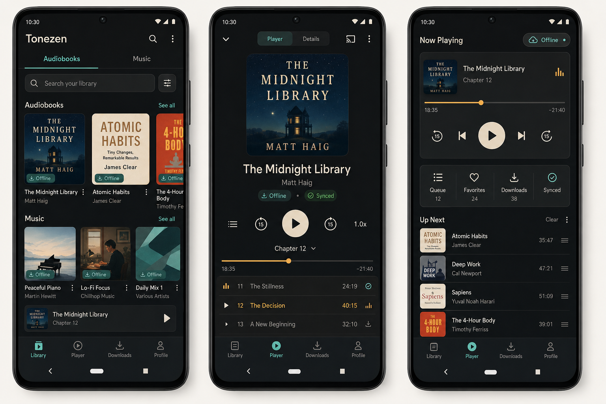
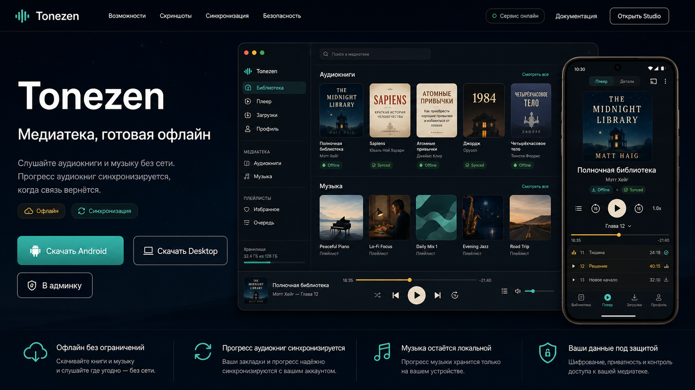

# Tonezen Brandbook

Tonezen is an offline-first media player for audiobooks and music. The product should feel calm, focused, and reliable: a personal media library that keeps working when the network disappears.

## Reference Mockups

These images are the current visual source of truth for the mobile app and landing page direction.

- [Main library/player reference](brandbook-assets/tonezen-main-reference.png)
- [Missing pages: sign in, downloads, profile, details](brandbook-assets/tonezen-missing-pages.png)
- [Modals and bottom sheets](brandbook-assets/tonezen-modals.png)
- [Landing page reference](brandbook-assets/tonezen-landing-fullhd.png)

## Product Principles

- Offline first: downloaded content and local playback feel first-class.
- Sync is visible, not noisy: audiobook progress, favorites, and catalog state use small chips and status rows.
- Music stays local: the UI must not imply server progress sync for music playback.
- Dense but calm: screens support real playback workflows without becoming a dashboard.
- Android first: layouts follow Material/Compose patterns, with touch targets of at least 48 dp.

## Brand Personality

Tonezen is quiet, capable, and slightly premium. It should look like a serious player for people who listen for long sessions, not like a social music app.

- Calm: dark surfaces, restrained animation, minimal copy.
- Trustworthy: explicit offline/sync states and clear download controls.
- Focused: playback and library browsing stay central.
- Warm: amber progress and cream play controls make the dark UI less sterile.

## Visual Direction

The screenshots define a dark media-player system with soft contrast, teal interaction states, and amber playback accents.

- Backgrounds use deep slate and near-black gradients.
- Cards and sheets use subtle borders, low elevation, and transparent surface layering.
- Primary actions use muted teal fills.
- Playback progress and active chapters use warm amber.
- Main playback buttons use a warm cream fill for contrast.
- Avoid purple gradients, decorative blobs, glassy blur, and marketing-page hero layouts.

## Core Palette

| Token | Hex | Usage |
| --- | --- | --- |
| `color.bg.app` | `#020617` | App background |
| `color.bg.surface` | `#0f172a` | Cards, bottom bars, modal surfaces |
| `color.bg.surfaceRaised` | `#172033` | Raised cards, search fields, form cards |
| `color.bg.surfaceMuted` | `#1e293b` | Controls, inactive pills, disabled buttons |
| `color.text.primary` | `#f8fafc` | Main text |
| `color.text.secondary` | `#94a3b8` | Metadata, inactive labels |
| `color.text.muted` | `#64748b` | Disabled and helper text |
| `color.accent.primary` | `#5eead4` | Selected nav, primary actions, online/synced UI |
| `color.accent.primaryStrong` | `#14b8a6` | Filled teal buttons and active pills |
| `color.accent.progress` | `#fcd34d` | Timeline, active chapter, pending state |
| `color.accent.cream` | `#f5e9d6` | Main play button |
| `color.status.offline` | `#fcd34d` | Offline availability and pending sync |
| `color.status.synced` | `#4ade80` | Successful sync state |
| `color.status.error` | `#f87171` | Errors and destructive actions |
| `color.border.default` | `#334155` | Card/control borders |

## Typography

Use an Inter-like sans-serif on Android and desktop. Keep letter spacing at `0`.

| Style | Size | Line height | Weight | Usage |
| --- | ---: | ---: | --- | --- |
| Display | 32 | 40 | Bold | Auth hero, player title when space allows |
| Screen Title | 24 | 32 | SemiBold | Screen headers |
| Section Title | 18 | 24 | SemiBold | Library, queue, settings sections |
| Body | 15 | 22 | Regular | Item titles and readable text |
| Label | 13 | 18 | Medium | Chips, tabs, bottom navigation |
| Caption | 12 | 16 | Regular | Metadata, durations, helper text |

Avoid viewport-scaled type. If text does not fit, wrap first; reduce content density before shrinking below caption size.

## Spacing And Shape

| Token | Value | Usage |
| --- | ---: | --- |
| `spacing.4` | 4 dp | Tight icon/text gaps |
| `spacing.8` | 8 dp | Chips, compact rows |
| `spacing.12` | 12 dp | Card internals |
| `spacing.16` | 16 dp | Standard section rhythm |
| `spacing.20` | 20 dp | Screen horizontal padding |
| `spacing.24` | 24 dp | Large card padding |
| `spacing.32` | 32 dp | Major screen separation |
| `radius.8` | 8 dp | Thumbnails, small controls |
| `radius.12` | 12 dp | Search, mini-player, rows |
| `radius.16` | 16 dp | Cards and covers |
| `radius.24` | 24 dp | Auth hero, bottom sheets |

## Screen Inventory

### Sign In / Onboarding

Shown in [tonezen-missing-pages.png](brandbook-assets/tonezen-missing-pages.png).

- Use a branded hero, not a bare login form.
- Lead with `Tonezen` and the headline `Your library, ready offline`.
- Show two value chips: `Offline playback` and `Progress sync`.
- Place fields inside a raised sign-in card.
- Keep the offline-safe auth promise visible: expired sessions stay active offline.

### Library

Shown in [tonezen-main-reference.png](brandbook-assets/tonezen-main-reference.png).

- Top-level tabs: `Audiobooks` and `Music`.
- Search row includes a filter control.
- Audiobooks and music use cover-card shelves.
- Mini-player is pinned above bottom navigation.
- `Offline` chips appear only for downloaded content.

### Player

Shown in [tonezen-main-reference.png](brandbook-assets/tonezen-main-reference.png).

- Large cover art is the visual anchor.
- Main action is a cream circular play button.
- Rewind/forward controls use `15` second affordances.
- Amber timeline communicates current progress.
- Active chapter row uses amber text and a subtle activity marker.
- `Synced` appears only for audiobook state.

### Now Playing / Queue

Shown in [tonezen-main-reference.png](brandbook-assets/tonezen-main-reference.png).

- The current item sits in a raised card with cover, title, chapter, timeline, and controls.
- Queue/favorites/downloads/synced metrics live in a compact stats card.
- Up Next rows use thumbnails, title, author, duration, and drag handle.

### Downloads

Shown in [tonezen-missing-pages.png](brandbook-assets/tonezen-missing-pages.png).

- Include tabs for `Audiobooks` and `Music`.
- Show storage summary at the top.
- Each row shows thumbnail, title, metadata, and progress.
- Bulk actions can appear at the bottom of the list.
- Delete actions use error red; pause/manage actions use teal.

### Profile / Sync

Shown in [tonezen-missing-pages.png](brandbook-assets/tonezen-missing-pages.png).

- Profile starts with a user card and online/offline chip.
- Sync status is a dedicated card, not hidden in settings.
- Settings rows: `Account`, `Sync`, `Storage`, `Privacy`.
- Always include a reminder that music progress stays local.

### Details

Shown in [tonezen-missing-pages.png](brandbook-assets/tonezen-missing-pages.png).

- Details can be reached from player or library.
- Use cover, metadata, stats, description, chapter entry, and actions.
- Primary actions: `Download`, `Start listening`.
- Secondary action: `Favorite`.

## Modal And Sheet Patterns

Shown in [tonezen-modals.png](brandbook-assets/tonezen-modals.png).

### Search And Filter Sheet

- Opens over Library with a dimmed background.
- Contains search, filter chips, sort selector, and `Reset` / `Apply`.
- Selected filters use teal border/fill.

### Download Confirmation Sheet

- Opens over Details or Player.
- States storage estimate before downloading.
- Uses toggles for optional content such as audio files and cover art.
- Primary action: `Download offline`; secondary action: `Cancel`.

### Track Actions Sheet

- Opens over Player.
- Shows selected chapter title and duration.
- Actions: `Play next`, `Mark complete`, `Remove download`, `Share`.
- Destructive rows use restrained red icon/text, not a full red surface.

### Offline Sync Dialog

- Opens over Profile or any sync-triggered action.
- Message: progress will sync when connection returns.
- Chips: `Offline`, `Pending`.
- Primary action keeps user in playback flow: `Keep listening`.
- Secondary action: `Retry`.

## Components

### Cover Card

Shows cover art, title, author, offline chip, and overflow affordance. Audiobooks and music share the shell. Sync-specific labels are audiobook-only.

### Status Chip

Compact rounded chip with optional dot or icon.

- `Offline`: downloaded and playable locally.
- `Online`: app can reach sync/catalog services.
- `Synced`: audiobook server progress is current.
- `Pending`: local audiobook changes are waiting to sync.
- `Paused`: sync or network state is temporarily unavailable.

### Search Field

Rounded raised input with a search icon. It should feel tappable even before text is entered.

### Segmented Tabs

Use for top-level content switches and player/detail switches. Selected segment uses teal fill or underline.

### Mini Player

Pinned above bottom navigation. It shows current cover, title, chapter/track, and play affordance. It must not block library browsing.

### Primary Button

Teal filled button for ordinary primary actions. Cream circular button is reserved for playback.

### Bottom Navigation

Four destinations: `Library`, `Player`, `Downloads`, `Profile`. Selected item uses teal. Inactive labels use secondary text.

## Content Rules

- Use `Audiobooks` and `Music` as top-level content groups.
- Use `Offline` only for downloaded content.
- Use `Synced` only for audiobook state.
- Use `Pending` for local audiobook changes waiting for sync.
- Do not show server-sync progress for music.
- Music progress copy must say local/on-device when mentioned.
- Error and offline messages should be short and actionable.
- Avoid placeholder copy such as lorem ipsum in mockups and implementation.

## Implementation Notes

- Android Compose should keep brand tokens in UI/theme code and user-facing strings in `strings.xml`.
- Desktop can map the same palette to Tailwind tokens.
- Production cover art should come from catalog artwork or signed image URLs.
- Generated cover blocks are acceptable only for development previews.
- Avoid direct HTTP access to content volume; use signed URLs for remote media/artwork.
