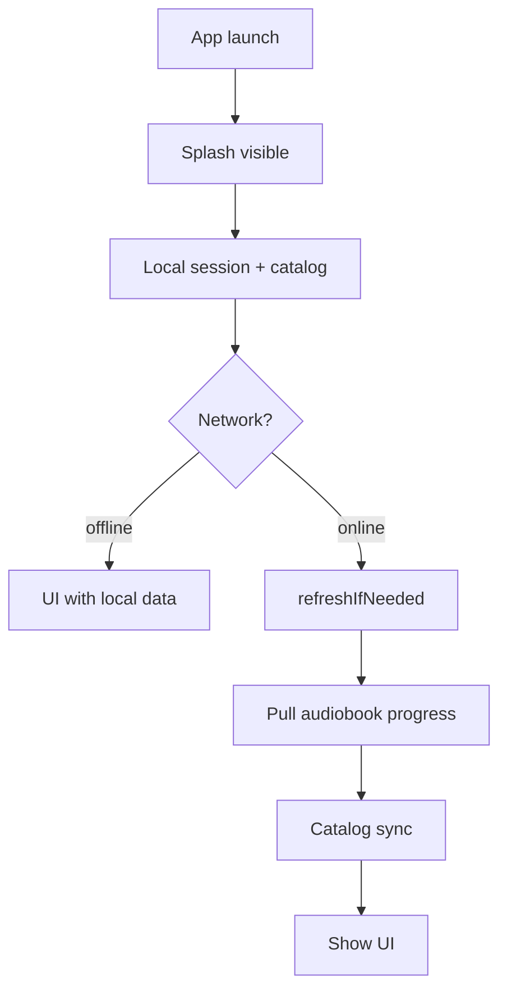
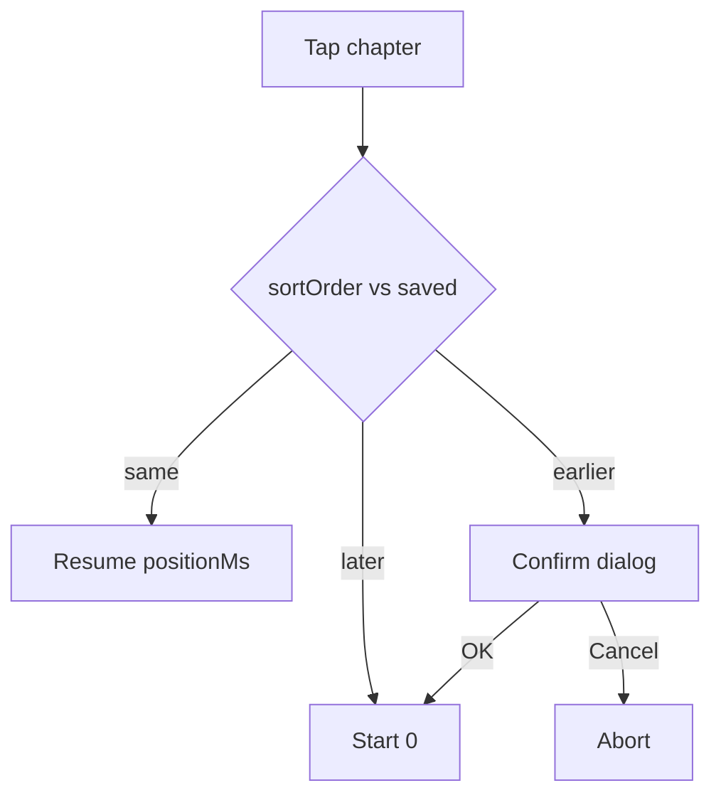
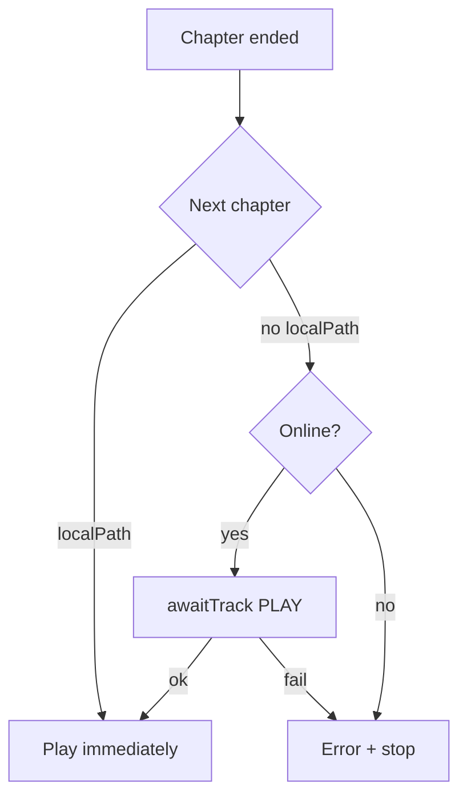

# Client user flows — Music & Audiobooks

> Normative spec for **Android** and **Desktop**. Both platforms must behave the same unless noted.

## General rules

- **Offline-first:** local cache is authoritative; sync when online.
- **Music progress:** local only — never synced to server.
- **Audiobook progress:** local write always; push/pull when authenticated and online. Server conflict authority is monotonic **`revision`** with CAS (`base_revision` on PUT), not client wall-clock. Local cache is **user-scoped**; logout must not leave another user’s play head in the sync set. Clients keep a **server snapshot** beside the play head; when they diverge at Continue/Play/resume, the user chooses «На устройстве» or «В облаке» (see A3b). Short server **history** exists for ops restore only — not a client UI.
- **UI language:** Russian only — copy inline at usage sites; no strings catalog or locale switching.
- **Download queue priorities:** `USER` (explicit tap) > `PLAY` (playback needs file) > `PREFETCH` (background next chapter/track) > `BULK` (download all). Progress % is shown only for the **currently active** download in a batch; queued items show icon until their turn.
- **Auth:** expired JWT while **offline** ≠ logout; refresh tokens **only when online**; never block cold start with synchronous JWT exp check without network.

## Playback vs download (anti-regression)

| Mode | Content | Examples | Not downloaded + online | Not downloaded + offline / fail |
|------|---------|----------|-------------------------|----------------------------------|
| Auto / wave (music) | music | «Моя волна», next/prev shuffle | Download `PLAY` | **Next playable** in list (`advancePlayback`) |
| Auto-advance (audiobooks) | audiobook | End of chapter, next in book/cycle | Download `PLAY` / prefetch | **Error + stop** — no skip to another chapter |
| Explicit pick | both | Tap track / chapter | Download `PLAY` | **Error**, no silent skip |
| Resume / cycle start | audiobook | Play cycle, Continue | Download `PLAY` for **target** chapter | **Error** if target not local — no forward walk |

**Forbidden without updating this doc:**

- «Моя волна» → `findFirstPlayable(0)` (card track must match playback start).
- «Моя волна» → offline error on first track without trying next playable tracks.
- Audiobook → silent skip to next downloaded chapter when offline.
- Explicit tap → silent skip.
- Play cycle → walk from book 1 instead of resume target.
- Play cycle offline → walk forward to first local chapter.
- Prefetch only on `trackEnded` without enqueue on **playback start**.

---

## Cold start (splash)

### S1. Splash bootstrap

**Trigger:** User launches the app.

**Preconditions:** None.

**Expected behavior:**

1. Splash screen visible immediately.
2. Read local session from storage (fast, always).
3. Detect network.
4. **Offline:** load local catalog + local audiobook progress → show UI immediately. No JWT refresh. No server pull.
5. **Online + session:** `refreshIfNeeded` (do not logout on expired JWT if we were offline); pull audiobook progress; start catalog sync (may continue in background after UI). Full catalog sync **upserts then prunes** local books/cycles/tracks that are no longer on the server (storage wipe alone does not remove stale catalog rows).
6. **No session:** show Auth after minimal local init.

**UI signals:** Splash branding; no blank frame; main UI or Auth when bootstrap completes.

**Invariants:**

- Music progress is **not** pulled on splash.
- Offline path must be fast — do not block on network timeouts.
- Desktop splash closes on `bootstrap-complete`, not only `ready-to-show`. Cold start attempts audiobook progress pull/`progressSync.start` **before** closing splash, but **fail-open** on offline or pull timeout (~4s) so local downloads stay playable.
- After bootstrap hydrate, `progressSync.start` must **not** clear the push gate and re-open a wipe window while the UI is up (keep hydration for the same user).
- **Online Auth → login (incl. reinstall):** brief splash for a **bounded** progress pull; on timeout/offline open the shell with local cache. Do not hang the UI on bad network.
- **Push gate:** do not HTTP-push audiobook progress until a successful progress pull for the current hydrated user. Persist hydrated user id across process starts for the same account; clear on logout.
- **Wipe-safe hydrate:** if local progress was empty at session start (reinstall), the first successful pull applies server rows to both play head and server snapshot. If local play head already existed, pull/Realtime update **server snapshot only** while `pending_sync` (do not silently overwrite listening). Do not auto-flush pending for a book with an active local↔server conflict.
- **CAS:** PUT sends `base_revision` (= last known server revision; `0` only when creating the first server row). Mismatch → 409 + current progress; refresh snapshot; do not loop dialogs in the same tap.

### S2. Login after Auth (incl. reinstall)

**Trigger:** User signs in on the Auth screen (fresh install or after logout).

**Preconditions:** Online (typical); local audiobook progress DB empty after reinstall.

**Expected behavior:**

1. Show splash (or keep blocking shell) immediately on session flip **when online**.
2. `refreshIfNeeded` → **bounded** pull `GET /progress/audiobooks` (~4s) → merge into local.
3. On success, timeout, or offline: show main UI; arm HTTP push only after a **successful** pull (background retry continues after fail-open).
4. Catalog sync may continue in background after UI.

**Invariants:**

- Never push pending local progress before the first successful pull after login/reinstall.
- Never block offline / poor-network users from playing already-downloaded content.
- Wipe-safe hydrate prefers server when local progress was empty at session start; otherwise keep play head and refresh server snapshot.
- On account switch / logout: drop or ignore other users’ local audiobook progress rows.
---

## Music

### M1. Download all

**Trigger:** «Скачать все» in music library.

**Preconditions:** At least one undownloaded track; online for new downloads.

**Expected behavior:**

1. Enqueue all missing tracks as `USER` batch (same priority as audiobook «скачать все» in book detail).
2. Show batch progress (`bulkDownloaded` / `bulkTotal`) on the button/card.
3. Each track row and Downloads tab shows % **only while that track is actively downloading**.
4. Queued tracks show download icon without % until active.

**UI signals:** Batch progress bar; per-row % or checkmark; Downloads tab mirrors active item.

**Domain anchors:** `TrackDownloadQueue.enqueueBatch`, `DownloadPriority.USER` (batch).

---

### M2. Play from «Моя волна»

**Trigger:** Tap play on «Моя волна» card (or card body when idle).

**Preconditions:** Music library has tracks.

**Expected behavior:**

1. Card shows current playing track when music is active; otherwise first track in wave list.
2. If music already playing → toggle pause/play (same track).
3. If idle → start from **track shown on card**, not first playable in list.
4. Track not downloaded + **online** → download (`PLAY`) then play.
5. Track not downloaded + **offline** or download failed → try **next playable** in list order; repeat until success or list exhausted.
6. Show error only if **no** playable track exists.

**UI signals:** Card title/artist match start track; spectrum animates when playing.

**Invariants:** Card display and playback start use the same «wave display track» helper.

**Domain anchors:** `MusicPlaybackAdvanceRules`, `advancePlayback` / `advanceToPlayableTrack`.

---

### M3. Play from «Все треки»

**Trigger:** Tap a specific track in expanded list.

**Preconditions:** User chose explicit track.

**Expected behavior:**

1. Queue from tapped track.
2. Download with `PLAY` if needed (online).
3. On failure → show error; **no** silent skip to another track.

**UI signals:** Now playing matches tapped track; error toast/snackbar on fail.

**Invariants:** Explicit pick ≠ auto-advance semantics.

---

## Audiobooks & cycles

### A1. Play cycle

**Trigger:** Play on cycle card.

**Preconditions:** Cycle has books with chapters.

**Expected behavior:**

1. Resolve target via `resolveCycleResumeTarget`: book with the **most recent** real listen progress (`updatedAt`, `listenedMs > 0`) — same winner as Continue UI. Reset heads (first chapter @ 0 / «не прослушанным») are ignored. If none → first chapter of first book.
2. **Online:** `awaitTrack` `PLAY` for target chapter → `playQueue` from resume position.
3. **Offline** without local target file → error, playback does **not** start; **no** forward walk to another downloaded chapter.

**UI signals:** Error message on offline/fail; player does not start wrong chapter.

**Domain anchors:** `resolveCycleResumeTarget`, `orderedCycleEntriesFromResume`.

---

### A2. Open cycle + header menu ⋮

**Trigger:** Tap cycle → cycle detail; ⋮ on cycle card / book.

**Expected behavior:** Navigate to books list; menu: mark listened / unlistened, download entire cycle, remove downloads.

**Mark listened / unlistened:**

1. **Listened:** write play head to last chapter @ duration (pending sync → push).
2. **Unlistened:** write play head to **first chapter @ 0** and sync — do **not** only delete the local row (pull/Realtime would restore the old server head).
3. Same rules for a single book and for the whole cycle (per book).

**UI signals:** `CycleDetailScreen` / `CycleDetailPage`; overflow menu actions.

---

### A3. Open book → Continue / Play

**Trigger:** Tap book → book detail.

**Expected behavior:**

1. If partial progress → «Продолжить» with resume metadata.
2. If no history and book not fully listened → «Воспроизвести» (first chapter).
3. Before starting, apply **A3b** if local play head and server snapshot diverge.
4. Continue/Play downloads target chapter if online; offline without local file → error, no skip.

**UI signals:** Primary play button («Продолжить» / «Воспроизвести»); chapter list. Transport controls live in the **mini player / now playing** only — not embedded in book detail.

---

### A3b. Local vs cloud progress choice

**Trigger:** Continue / Play / resume / play-cycle target for an **audiobook** when domain detects a sync conflict.

**Preconditions:** A server snapshot exists for the book (`server_revision` known). Music never uses this flow.

**Conflict rule (shared domain):**

- Same track and local `position_ms ≥ server_position_ms` → **not** a conflict (device listened ahead of a stale snapshot / pending push).
- Same track and server ahead by `|Δ| ≥ 30_000` → conflict.
- Different tracks → conflict only if `server_revision >` client `revision` (another device wrote). Local chapter advance on the same revision is pending push, not a dialog.
- No snapshot → no dialog.

**Expected behavior:**

1. Show dialog only for a real fork: progress on device and in cloud differ as above; show both points (chapter title + time when tracks are loaded).
2. Buttons: **«На устройстве»** / **«В облаке»**. Dismiss/close aborts start (same as Cancel on earlier-chapter confirm).
3. **«На устройстве»:** start from local play head; keep/set `pending_sync`; push with CAS using known server revision as `base_revision`.
4. **«В облаке»:** apply server snapshot to play head; clear `pending_sync`; start from cloud point; CAS base = `server_revision`.
5. After a choice, do not re-prompt until play head or snapshot diverges again.
6. If **A3b**, **A7b**, and/or **A7** apply: resolve A3b first, then earlier-cycle-book (A7b), then earlier-chapter (A7).
7. Jumping to an **earlier chapter than the saved play head** uses **A7** confirm — not A3b. Re-opening the app and tapping the same chapter after listening must **Resume**, not A3b.

**UI signals:** Dedicated sync-conflict dialog (Desktop/Android); Russian copy inline.

**Domain anchors:** progress conflict helper (≥30s / track mismatch); playback intents separate from `ConfirmEarlierChapter`.

---

### A4. Chapter list — listen progress + download status

**Trigger:** Book detail chapter list visible.

**Expected behavior:**

1. Each row: listen progress bar; checkmark if downloaded; % if **actively** downloading via queue; download button if not local.
2. **E2E:** tap download → queue worker → `localPath` in DB → checkmark without leaving page.
3. Fail / offline → explicit feedback (toast/snackbar), not silent no-op.
4. Play-initiated downloads use queue (`PLAY`) — same progress source as button download.

**UI signals:** `ChapterTrackRow`; `TrackDownloadedIndicator`; `TrackDownloadButton`; queue progress.

**Invariants:** Single download path through queue for USER and PLAY priorities.

---

### A5. Book header ⋮ — download all chapters

**Trigger:** ⋮ in book detail header → download book.

**Expected behavior:** Enqueue **all** missing chapters in batch (not one track).

**UI signals:** Batch progress in header menu area if applicable.

**Domain anchors:** `downloadAllMissingTracks` / `enqueueBatch`.

---

### A6. Chapter row ⋮ — mark listened

**Trigger:** ⋮ on chapter row.

**Expected behavior:** Mark chapter (and prior chapters per rules) as listened.

---

### A7. Tap chapter — playback intent

**Trigger:** Tap chapter row (not download button).

**Preconditions:** Saved book progress may exist.

**Expected behavior:**

1. Resolve intent via `resolveAudiobookPlaybackIntent` (after **A3b** and **A7b** if they apply):
   - Same track as saved progress → `Resume(positionMs)`.
   - Later chapter than saved → `StartFromZero`.
   - Earlier chapter than saved → `ConfirmEarlierChapter` → dialog; Cancel aborts; OK starts from 0.
2. After resolve (and confirm): download `PLAY` if needed.
3. On fail → error, no skip.

**Domain anchors:** `resolveAudiobookPlaybackIntent`, `resolveAudiobookPlaybackStartMs`.

---

### A7b. Start earlier book in cycle

**Trigger:** Continue / Play / tap chapter on a book that belongs to a cycle (book detail; Android cycle-detail «Продолжить» → auto-resume).

**Preconditions:** Cycle has real listen progress (`listenedMs > 0`) on some book.

**Expected behavior:**

1. Find later books in cycle order with **real** listen progress (`listenedMs > 0`; first-chapter @ 0 = «unlistened» and does not count).
2. If any such later book has `updatedAt` ≥ the starting book’s real progress (or the starting book has none) → show confirm with the latest of those later titles; Cancel aborts; OK continues into normal A3b/A7/start.
3. On successful start, clients **immediately** persist a play head for the started book with `positionMs ≥ 1` so last-listen / Continue switch to it (bare `0` stays reserved for «не прослушанным»).
4. Prompt order: **A3b** (sync conflict) → **A7b** (earlier cycle book) → **A7** (earlier chapter).
5. **Play cycle** (A1) does **not** use this prompt — it already resumes the latest listen.

**UI signals:** Same glass/modal pattern as earlier-chapter confirm (Android/Desktop); Russian copy inline.

**Domain anchors:** `resolveEarlierCycleBookConfirm`, `findCycleContainingBook`.

---

### A8. Downloaded indicator

**Trigger:** Chapter has `localPath`.

**Expected behavior:** Show checkmark; hide download button.

---

### A9. Download progress %

**Trigger:** Chapter actively downloading via queue.

**Expected behavior:** Show % on that row only; other queued rows show icon without %.

---

### A10. Download button

**Trigger:** Tap download on undownloaded chapter.

**Expected behavior:** Enqueue `USER`; show progress when active; offline → «Нет сети» feedback.

---

### A11. Prefetch next chapter + auto-advance

**Trigger:** Audiobook playback starts; chapter ends.

**On playback start (online):**

1. Enqueue next chapter in book/cycle with `PREFETCH`.

**On chapter end:**

**Invariants:** Offline + next not downloaded → error + **stop player**; never skip to another downloaded chapter.

**Domain anchors:** `nextAudiobookDownloadRequest`, `DownloadPriority.PREFETCH`.

---

## Download status in lists (checklist)

- [ ] Tap download → file on disk → `localPath` persisted → checkmark in list
- [ ] Play undownloaded chapter → queue `PLAY` → % visible in row
- [ ] Offline tap download → user-visible «Нет сети»
- [ ] Download failure → snackbar/toast, not silent
- [ ] Batch: % only on active item
- [ ] Android path canonicalization (`sanitizeStoredLocalPath`) — file exists ⇒ UI shows downloaded

---

## Account

### A1. Change password (authenticated)

**Trigger:** User submits «Сменить пароль» in account settings.

**Preconditions:** Signed in; online.

**Expected behavior:**

1. Form requires **current password**, new password, and confirmation.
2. Client calls `POST /api/v1/auth/password` with Bearer access token and `{ current_password, password }`.
3. Server verifies current password via GoTrue password grant, then updates password.
4. Wrong current password → user-visible error; do not clear the session.
5. Password recovery from the landing page still uses `POST /api/v1/auth/password/update` with a recovery access token (no current password).

**Forbidden without updating this doc:** changing password with only an access token and no current-password check from the in-app account settings UI.

---

## Domain anchors (reference)

| Function | Platform | Path |
|----------|----------|------|
| `resolveCycleResumeTarget` | Android | `domain/progress/CycleListenProgress.kt` |
| `resolveCycleResumeTarget` | Desktop | `core/playback/cycleListenProgress.ts` |
| `resolveEarlierCycleBookConfirm` | Both | `CycleListenProgress` / `cycleListenProgress.ts` |
| `resolveAudiobookPlaybackIntent` | Both | `shared/` + `domain/progress/` |
| `resolveAudiobookPlaybackStartMs` | Android | `domain/progress/TrackListenProgress.kt` |
| `nextAudiobookDownloadRequest` | Desktop | `shared/audiobookDownloadTarget.ts` |
| `MusicPlaybackAdvanceRules` | Android | `domain/playback/` |
| `advanceToPlayableTrack` | Desktop | `hooks/useMusicPlayback.ts` |
